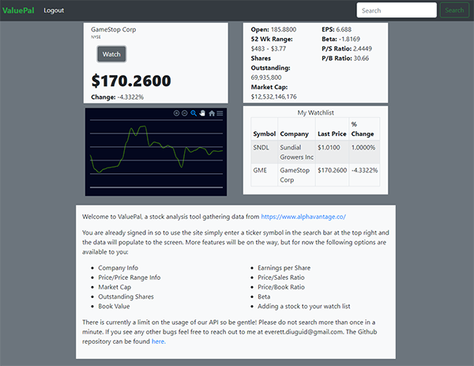

# ValuePal: Stock Analysis Tool

A stock analysis/data tool using the AlphaAvantage Stock API displaying latest stock quotes and related data.

## Table of Contents

- [Usage](#usage)
- [Installation](#installation)
- [Explanation of Tech](#Explanation-of-Technology)
- [Future Improvements](#future-improvements)
- [Contributing](#contributing)
- [Questions](#questions)
- [License](#license)

## Usage

1. To access the site the user may create an account by clicking `create account` or by using the demo sign in username: `Temp@valuePal.com` password: `password`. After signing up, enter the login credentials and enter the website.

2. The search bar is located in the top right corner, the user will enter a stock ticker and click `Search`.

3. Once the data is populated to the page, the user can click `Watch` to add that current stocks data to their watch list. The entry should appear on the right side of the top of the page.

4. To logout, click `Logout` and the user will be returned to the sign in page.

5. The api we use is limited to 1 search per minute so after searching for a stock, the search button will be disabled for 1 minute.

## Installation

To install this application locally, clone the repository and run npm install from the root directory, this should install all the necessary dependencies. If running the application locally use the command `npm run dev` which will start the express server and react server concurrently.

## Explanation of Technology

This is a Pern stack application. The front end is handled with `reactjs` and `redux` using a template created with `npx create-react-app`. The front end styling is mostly SCSS using the `node-sass` npm package with all frontend components utilizing the `react-bootstrap` package. Data is stored to a postgreSQL database. The backend routing is handled with `express.js` and the package manager used is `node.js`.

## Future Improvements

In the future it would be great to have more flexibility with the API. The prememium membership for AlphaAdvantage is $50 a month for up to 75 calls a minute. At this time, one click of the search button uses 3 api calls. The free option for the api limits use to 5 calls per minute. I would also like to add more stock analysis, the api has a multitude of information related to the stock searched, so finding a way to provide the user with more in depth analysis would add functionality and use to the application.

## Contributing

Your contribution is most welcome! Please refer to the contributing guidelines when making contributions to this project.

Any contributions for this web page are definitely welcome, just send me a PR.

Please note that this project is released with a [Contributor Code of Conduct](code_of_conduct.md). By Participating in this project, you agree to abide by its terms.

## Questions

Please reach out to me @ `everett.diuguid@gmail.com` with any questions regarding this project.

## License

[MIT](LICENSE) copyright (c) 2021 Everett Diuguid.

[back to Table of Contents](#table-of-contents)
